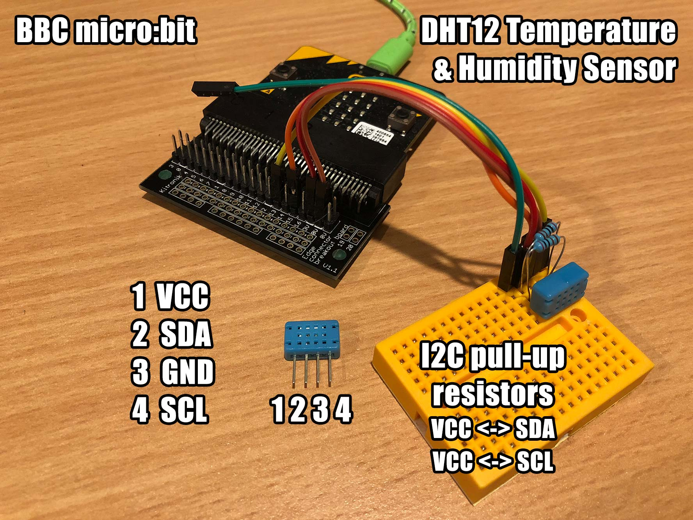

# BBC micro:bit MicroPython DHT12 I2C

A micro:bit MicroPython library for interfacing with an Aosong DHT12 temperature and humidity sensor over I2C.

This library focuses on using the I2C interface. The sensor also supports a 1-wire interface, available when pin 4 is connected to GND.



# Examples

In these examples, I am using pins 13 and 15 for [I2C](http://microbit-micropython.readthedocs.io/en/latest/i2c.html) clock and data, however, you can use any pin. Pins 13 and 15 are normally used for SPI.
My Kitronik edge connector breakout board does not have pin headers soldered for the [standard I2C pins](http://microbit-micropython.readthedocs.io/en/latest/pin.html) 19 and 20 (where you can find the accelerometer and compass), otherwise I'd be using them.

Basic measurement

```
from microbit import *
import dht12

i2c.init(sda=pin15, scl=pin13)
sensor = dht12.DHT12(i2c)

sensor.measure()
print(sensor.temperature())
print(sensor.humidity())
```

Press Button A to measure, Button B to exit

```
from microbit import *
import dht12

i2c.init(sda=pin15, scl=pin13)
sensor = dht12.DHT12(i2c)

while True:
	if button_a.is_pressed():
		try:
			sensor.measure()
			display.scroll(str(sensor.temperature())+"c", 50)
		except OSError:
			display.scroll("Err")
	if button_b.is_pressed():
		display.scroll("End")
		break
```

Continuous measurement

```
from microbit import *
import dht12

i2c.init(sda=pin15, scl=pin13)
sensor = dht12.DHT12(i2c)

while True:
	try:
		sensor.measure()
		print(sensor.temperature())
		print(sensor.humidity())
		sleep(4000)
	except OSError:
		print("Error")
		sleep(1000)
```

## Links

* [BBC micro:bit](http://microbit.org/)
* [MicroPython for the BBC micro:bit](https://github.com/bbcmicrobit/micropython)
* [Kitronik Edge Connector Breakout Board](https://www.https://www.kitronik.co.uk/5601b-edge-connector-breakout-board-for-bbc-microbit-pre-built.html.co.uk/5601b-edge-connector-breakout-board-for-bbc-microbit-pre-built.html)
* [micropython.org](http://micropython.org)
* [micro:bit on the MicroPython forum](https://forum.micropython.org/viewforum.php?f=17)
* [MicroPython DHT12](https://github.com/mcauser/micropython-dht12)
